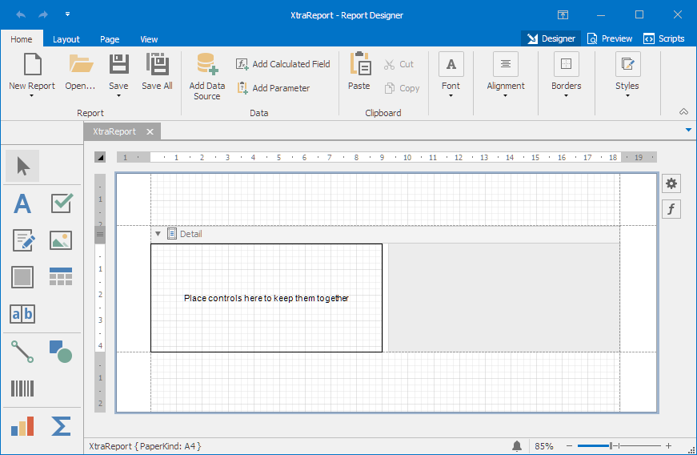
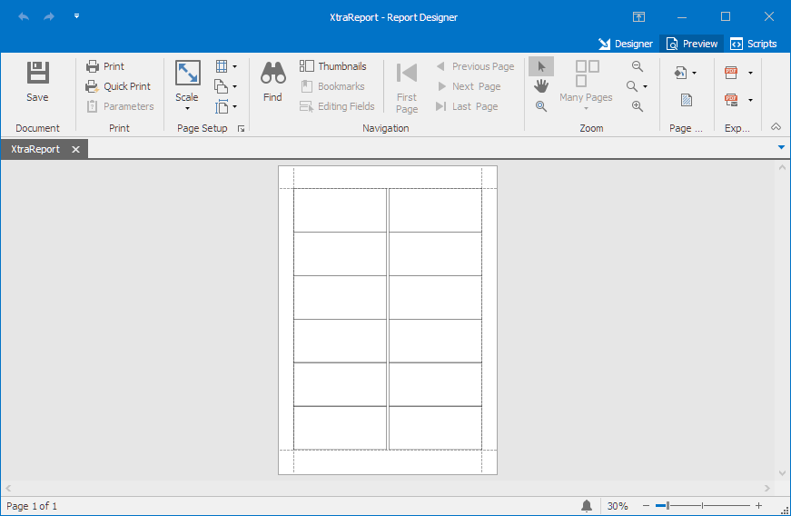

<!-- default badges list -->

<!-- default badges end -->

# Reporting for WinForms - Create Label Report in Code

This example demonstrates how to create a [label report](https://docs.devexpress.com/XtraReports/4792/create-popular-reports/create-labels-and-badges) at runtime.

To create a report formatted to fit your labels, it is necessary to adjust some specific layout settings. Users can create labels using the [Label Report Wizard](https://docs.devexpress.com/XtraReports/114845/create-end-user-reporting-applications/wpf-reporting/end-user-report-designer/gui/report-wizard/label-report) with just a few clicks.
However, sometimes you need to create labels at runtime. This example shows what report settings need to be configured for a particular type of label.

This example uses the `CustomLabelReportBuilder` helper class that follows the report creation algorithm used by our Label Report Wizard. A `CustomLabelReportModel` class implements the following label settings.

- `LabelWidth`, `LabelHeight`  
Specifies the width and height of [XRPanel](https://docs.devexpress.com/XtraReports/DevExpress.XtraReports.UI.XRPanel) placed into the [Detail](https://docs.devexpress.com/XtraReports/2587/detailed-guide-to-devexpress-reporting/introduction-to-banded-reports) report band.
- `HorizontalPitch`  
Specifies the Detail band's multi-column settings: [MultiColumn.ColumnWidth](https://docs.devexpress.com/XtraReports/DevExpress.XtraReports.UI.MultiColumn.ColumnWidth) and [MultiColumn.ColumnSpacing](https://docs.devexpress.com/XtraReports/DevExpress.XtraReports.UI.MultiColumn.ColumnSpacing).
- `VerticalPitch`  
Defines the [DetailBand.Height](https://docs.devexpress.com/XtraReports/DevExpress.XtraReports.UI.XRControl.Height) property.
- `MeasurementUnit`  
Defines the [XtraReport.ReportUnit](https://docs.devexpress.com/XtraReports/DevExpress.XtraReports.UI.XtraReport.ReportUnit) property.
- `PaperKindID`  
Converts to a corresponding System.Drawing.Printing.PaperKind enumeration value that is further passed to the [XtraReport.PaperKind](https://docs.devexpress.com/XtraReports/DevExpress.XtraReports.UI.XtraReport.PaperKind) property.
- `TopMargin`, `LeftMargin`  
Defines the [top and left report margins](https://docs.devexpress.com/XtraReports/DevExpress.XtraReports.UI.XtraReport.Margins).
- `BottomMargin and RightMargin`  
These are empty spaces that appear on the resulting report page as right and bottom spaces. These values are calculated based on other settings.

The `CustomLabelReportBuilder.GenerateLabelReport` method generates a report with a `CustomLabelReportModel` object or individual settings (listed above) as an argument(s).

The `LabelReportValuesHelper` class has methods used to fetch label report type settings, such as **Label Products** list or **Product Details**.

You can store label settings in `custom XML` files. To do this, you must pass the path to the custom XML file to the `LabelReportValuesHelper` constructor.

The standard label report wizard can retrieve custom XML. Use the static [DevExpress.Data.XtraReports.Labels.LabelWizardCustomization.ExternalLabelProductRepository](https://docs.devexpress.com/XtraReports/DevExpress.XtraReports.Wizards.Labels.LabelWizardCustomization.ExternalLabelProductRepository) property at the application start to specify a path to an XML file.

## Files to Review

* [Form1.cs](CS/Reporting_how-to-create-a-label-report-at-runtime-t473792/Form1.cs) (VB: [Form1.vb](VB/Reporting_how-to-create-a-label-report-at-runtime-t473792/Form1.vb))
* [CustomLabelReportBuilder.cs](CS/Reporting_how-to-create-a-label-report-at-runtime-t473792/LabelReportRuntime/CustomLabelReportBuilder.cs) (VB: [CustomLabelReportBuilder.vb](VB/Reporting_how-to-create-a-label-report-at-runtime-t473792/LabelReportRuntime/CustomLabelReportBuilder.vb))
* [CustomLabelReportModel.cs](CS/Reporting_how-to-create-a-label-report-at-runtime-t473792/LabelReportRuntime/CustomLabelReportModel.cs) (VB: [CustomLabelReportModel.vb](VB/Reporting_how-to-create-a-label-report-at-runtime-t473792/LabelReportRuntime/CustomLabelReportModel.vb))
* [LabelReportValuesHelper.cs](CS/Reporting_how-to-create-a-label-report-at-runtime-t473792/LabelReportRuntime/LabelReportValuesHelper.cs) (VB: [LabelReportValuesHelper.vb](VB/Reporting_how-to-create-a-label-report-at-runtime-t473792/LabelReportRuntime/LabelReportValuesHelper.vb))
* [Program.cs](CS/Reporting_how-to-create-a-label-report-at-runtime-t473792/Program.cs) (VB: [Program.vb](VB/Reporting_how-to-create-a-label-report-at-runtime-t473792/Program.vb))

## Documentation

- [Create Labels and Badges](https://docs.devexpress.com/XtraReports/4792/create-reports/create-labels-and-badges)
- [Report Wizard - Labels](https://docs.devexpress.com/XtraReports/4242/visual-studio-report-designer/report-wizard/labels)
- [Bind a Report to a Microsoft SQL Server Database at Runtime](https://docs.devexpress.com/XtraReports/4793/detailed-guide-to-devexpress-reporting/bind-reports-to-data/sql-database/bind-a-report-to-a-microsoft-sql-server-database-runtime-sample)

## More Examples

- [How to Create a Custom DevExpress Report Control](https://github.com/DevExpress-Examples/Reporting-Custom-Controls)
